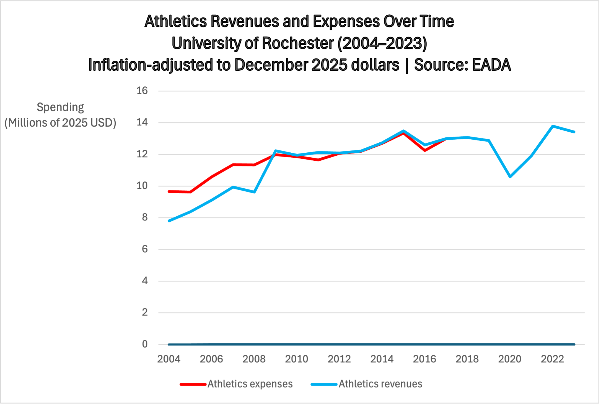
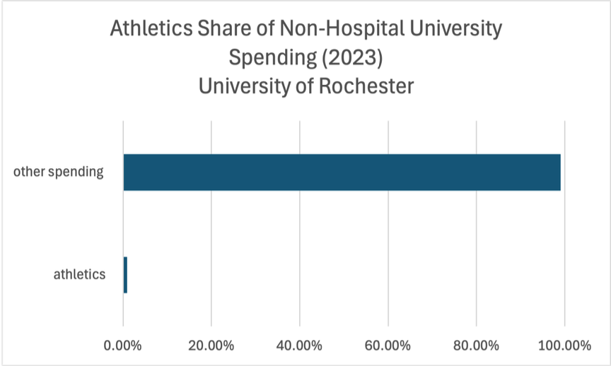
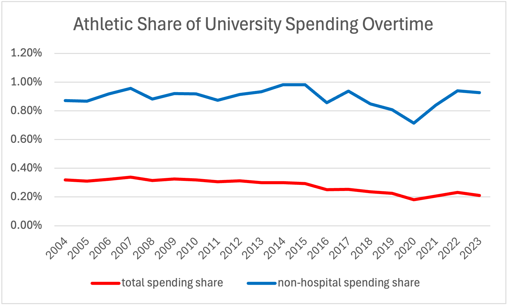
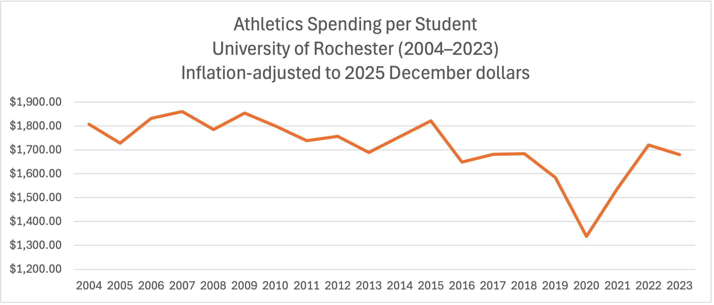

# Are College Sports Driving Tuition?

### Data Analysis Project – University of Rochester

This project examines a common claim that college athletics are a major driver of rising university tuition. Using financial data from the University of Rochester, the analysis evaluates athletics spending trends, its share of university expenditures, and its cost per student.

## Data Sources

• Equity in Athletics Disclosure Act (EADA)  
• Integrated Postsecondary Education Data System (IPEDS)  
• U.S. Bureau of Labor Statistics CPI data  

## Files Included

- Final research paper (PDF)
- Cleaned datasets (CSV)
- Visualization files used to generate charts
- Raw data sources

# Main text

Athletics are frequently portrayed as a major source of rising tuition at American universities. However, evidence from the University of Rochester suggests that athletics represent only a very small fraction of overall spending and therefore cannot be a primary driver of tuition increases. Instead, athletics may function as a visible scapegoat that distracts from deeper structural issues within university governance. In particular, the expansion of administrative units and the institutional incentives facing universities can create a classic principal–agent problem, in which the priorities of university administrators diverge from the interests of students who ultimately bear the financial burden.

In public discussions about rising tuition, athletics are often treated as a convenient scapegoat. Universities are frequently criticized for maintaining athletic programs while tuition continues to rise year after year. If athletics truly consumed a substantial portion of university resources, cutting athletic spending might appear to be a logical response. However, such claims must be evaluated with data. Before assigning blame, it is necessary to examine how much universities actually spend on athletics relative to their overall budgets. Figure 1 presents the trend in athletics revenues and expenses at the University of Rochester

### Athletics Revenue vs Expenses (Figure 1)

At first glance to figure 1, the trend in athletics spending appears to support the common belief that athletics contribute to rising tuition. As shown in Figure 1, athletics expenditures at the University of Rochester increased from roughly $8 million in 2004 to about $14 million in 2023. Observed in isolation, this upward trend could easily give the impression that athletics represent a growing financial burden on the university. In several years, athletics expenses even exceeded reported revenues. However, it is important to note that these “revenues” do not reflect profits generated by athletics programs themselves. Instead, much of the reported revenue consists of institutional support, student fees, and other internal transfers from the university. Viewed solely from the perspective of total spending and trend, athletics may appear to be a costly and continuously expanding activity, which helps explain why athletics are often blamed for rising tuition.

However, it is important to consider the scale of the university. In the most recent year, the University of Rochester enrolled approximately 11,946 students. Even when focusing only on undergraduate students, there are more than 6,500 students enrolled. Given the large size of the student body and the level of tuition charged by the university, the total amount spent on athletics may appear less significant when distributed across students. Nevertheless, this simple calculation alone is not sufficient to draw firm conclusions. A more informative approach is to examine athletics spending relative to the university’s overall budget. Figure 2 therefore presents the share of university spending devoted to athletics.

### Athletics Share of University Spending (Figure 2)

### Athletics Share of University Spending (Figure 3)

As shown in Figure 2 and Figure 3, athletics account for only a very small share of the University of Rochester’s total spending, consistently remaining between roughly 0.7% and 1%. It is important to note that this measure refers to university spending excluding hospital expenditures. Since the University of Rochester operates a large medical system with its own revenue streams, removing hospital spending provides a clearer picture of the university budget that is more closely tied to tuition and student-related funding. Even under this more restrictive measure, athletics still account for less than 1% of total university spending. Therefore, the effect of athletics on tuition is extremely limited. Eliminating athletics entirely would likely reduce tuition by only a very small amount—roughly around one percent—while significantly altering the campus experience that many students value.

### Athletics Spending per Student (Figure 4)

As shown in Figure 4, when athletics spending is distributed across the student body, the cost amounts to roughly $1,300 to no more than about $1,900 per student per year. While this is not a trivial amount, it represents only a very small portion of total tuition. Eliminating athletics would therefore provide only a modest reduction in tuition. Moreover, athletics may provide benefits that extend beyond direct financial considerations. In many universities, athletic programs contribute to institutional visibility, student engagement, and alumni identity. For some students, the opportunity to participate in varsity athletics is also an important factor in their decision to enroll.

An additional consideration is the long-term trend in tuition growth. As shown in figure 5, over the past several decades, tuition at the University of Rochester has increased at an average rate of roughly 4.35 percents per year. Even if eliminating athletics were to reduce tuition by around $1,900 in a given year, that reduction would likely be offset within a short period by the ongoing upward trend in tuition. In other words, removing athletics would not fundamentally alter the trajectory of rising tuition while potentially eliminating programs that many students value.


In conclusion, athletics have only a minimal impact on tuition at the University of Rochester. Instead, rising tuition may reflect broader structural trends in higher education, including the expansion of administrative units and student service offices—such as Greene centers, DEIs offices, and other support programs—which require significant staffing and resources while producing outcomes that are difficult to measure financially. At the same time, universities’ ability to engage in price discrimination through financial aid policies and rising sticker tuition also contributes to the continued increase in tuition.

## Author

Zhenlin Shou
